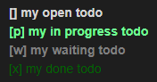

# commonplace

[](https://github.com/sandro-h/commonplace/actions/workflows/ci.yml)
[](https://sonarcloud.io/summary/new_code?id=sandro-h_commonplace)

VSCode extension for text-based TODO lists and notes.

**Work in progress and primarily used as a personal extension.**

## Features

* Simple, human-readable text format
* Hierarchical todos, recurring todos, priorities, date ranges, due dates
* Arbitrary comments under todos allow to keep a work log for each todo. E.g. copy-pasting shell commands used to complete a todo.
* Format highlighting in VSCode
* Commands to `clean` and `trash` done todos. `clean` moves them to end of file, `trash` moves them to todo-trash.txt
* Command to copy a todo comment without the indentation..
* Create links for ticket keys (e.g. JIRA).

## Limitations

* Limited support for time-of-day. Almost all features ignore time-of-day, the core granularity is days. Time of day is just an information for the user.
* No built-in device syncing (but todo.txt file can be synced with standard file sharing services, e.g. Dropbox)
* No mobile app (though you can view & edit the todo.txt in a mobile text editor)

## Text syntax

### Category


With HTML color (to differentiate calendar entries):


### Todo


Hierarchical todos:


Work states:



Comments:


On a specific day:


At a specific date and time:


Time range:


Recurring:


Important (!):


## Development

Building:

```shell
make dependencies
make core
make vscode-extension
```

Unit testing and linting:

```shell
make test
make lint
```

System testing:

```shell
make start-test-server
make system-test
```

### Development notes

#### Testing approach

Where possible, use system tests against the REST API of the running app. Rationale: this makes the test portable against other implementations.

#### @commonplace/lib dependencies

We declare date-fns as a *dev* dependency because we explicitly allowed webpack to bundle it with our code (instead of excluding
it as an external). We do this because we can profit from tree  shaking so that we don't need to depend on the full date-fns
library when using the commonplace library.
